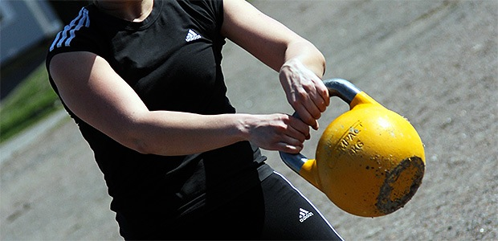

### KAHVAKUULAKURSSI

Tule mukaan opettelemaan kahvakuulan tekniikat. 

- Kahvakuulailu on hyvä voimanhankintakeino, kunhan vain tietää kuinka sillä harjoitellaan. 

- Kurssilla paneudumme rauhassa liikkeiden opettelemiseen. Kurssin tarkoitus on antaa valmiudet omatoimiseen harjoitteluun. Lisäksi saat hyvän taitopohjan kahvakuularyhmätunneille osallistumiseen. Kun suoritustekniikat on hallussa, niin myös ryhmäliikuntatunnista saa enemmän hyötyä.

- Pääpaino on liikkeiden opettelussa, mutta joka kurssikerran jälkeen huomaat tehneesi illan voimaharjoituksen kuin huomaamatta. Aiempaa kokemusta ei tarvitse olla, vaan voit tulla rennoin mielin matalan kynnyksen kurssille opettelemaan kanssamme uusia taitoja.

Kurssin kesto 6 viikkoa, 1x/viikko. Alkaen Maanantaina 22.8.2016 klo 18:00-19:00 LiikeVoimalla.

Hinta **79€** (kuntosalimaksu sisältyy hintaan). Ilmoittaudu sähköpostilla [tiialotta@liikevoima.fi](mailto:tiialotta@liikevoima.fi) tai puhelimitse 050-3520850

