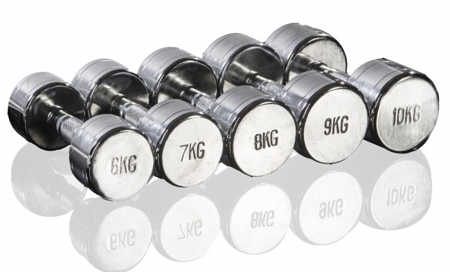

##### KUNTOSALIKURSSI

Tule mukaan opettelemaan kuntosaliharjoittelun perusteet:

- Kuntosalikurssilla opettelemme kattavan liikepankin ja oikeaoppisen suoritustekniikan kuhunkin liikkeeseen.

- Opettelemme tavoitteen mukaisen harjoittelun perusteita rauhallisesti edeten. Kuntosaliharjoittelusta ei tarvitse olla aiempaa kokemusta. 

- Pääpaino on vapaapainoharjoittelussa (levytanko, pienvälineet).

Kurssin kesto 6 viikkoa, 1x/viikko. Alkaen tiistaina 23.8.2016 klo 17:30-18:30 LiikeVoimalla.

Hinta **79€** (kuntosalimaksu sisältyy hintaan)

Ilmoittaudu sähköpostilla [ansku@liikevoima.fi](mailto:ansku@liikevoima.fi)

