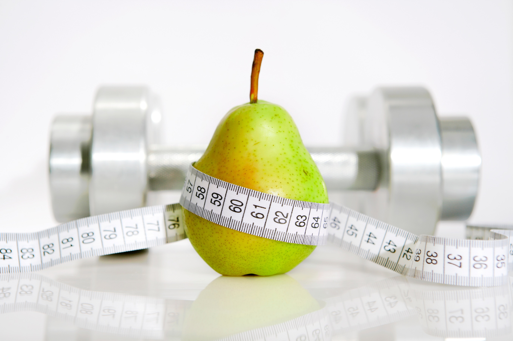

##### PAINONHALLINTAA LOPPUELÄMÄKSI -KURSSI

Liity nyt iloisimpaan painonhallintaryhmään ja nauti syksystä ilman painonnousua.

Tämä ryhmä on pienryhmävalmennuspohjainen kurssi, jossa mukana seuraavat osa-alueet:

- Kokonaisvaltainen elämäntapamuutos, liittyen ravintoon ja liikuntaan, opettelemme syömään oikeassa ateriarytmissä ja terveyttä edistäen.

- Ravintoluennot 4kpl, sisältäen rasvojen oikean saantisuosituksen, Immuunipuolustusjärjestelmän tukeminen painoa pudottaessa, Maksan myrkynpoistojärjestelmän tukeminen ja vitamiini-kivennäisaineiden imeytyminen painoa pudottaessa, Hormonitoiminnan tukeminen ja hormonitoiminnan vaikutus laihtumiseen.

- Henkilökohtainen tapaaminen valmentajan kanssa kerran kuussa.
- 1 x viikossa ohjattu treeni LiikeVoimalla oman kuntotason huomioon ottaen sekä harjoituskalenterin luominen yhdessä valmentajan kanssa.

Kurssin kesto 4kk. 
Kurssin hinta jäsenille 60€/kk (muille 99€/kk) sisältäen yhteisen treenin ja luennot, sekä liikuntasuunnitelman.
Ensimmäinen kokoontuminen on su 21.8 klo 13-14 LiikeVoimalla. Luvassa kurssin esittely ja kahvitarjoilu

Ilmoittaudu sähköpostilla [tiialotta@liikevoima.fi](mailto:tiialotta@liikevoima.fi) tai puhelimitse 050-3520850

