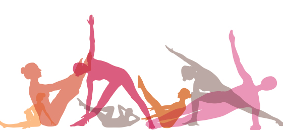

##### Pilates -peruskurssi

Pilates palkitsee, sillä se pystyy tarjoamaan hyötyjä, vasta-alkajista huippu-urheilijoihin. Tavoitteena on oman kehon tunteminen ja hallinta.

- Keskikehon ryhti ja lihashallinta paranevat. 
- Selän ja niska-hartia-alueen kiputiloista kärsivät hyötyvät usein pilates-harjoittelusta.
- Pilateksessa on tavoitteena terve, vahva ja notkea tukiranka. 

Menetelmä perustuu tehokkaaseen vartalon tukilihasten harjoitteluun ja oikeaan hengitystekniikkaan - niiden yhdistämiseen. Kokonaisvaltaisuutta korostetaan, liikkeiden lisäksi tarkka keskittyminen on tärkeää. Pilates-tunneilla ohjaaja pyrkii seuraamaan ja ohjaamaan jokaista ryhmäläistä, myös yksilöllisesti.

Pilateksen liikkeet ja harjoitteet keskittyvät sekä lihasvoiman että lihaskoordinaation ja kehon hallinnan kehittämiseen. Osassa harjoituksista pyritään parantamaan myös notkeutta ja tasapainoa.
Suosittelen tunnille vähän lämpimämpää pukeutumista, kuten pitkiä housuja ja pitkähihaista paitaa. Omaa mattoa et tarvitse.

Seuraava kuuden viikon peruskurssi alkaa su 21.8 klo 17

Kurssin hinta vain **45€**. Ilmoittaudu sähköpostilla [tiialotta@liikevoima.fi](mailto:tiialotta@liikevoima.fi) tai puhelimitse 050-3520850

